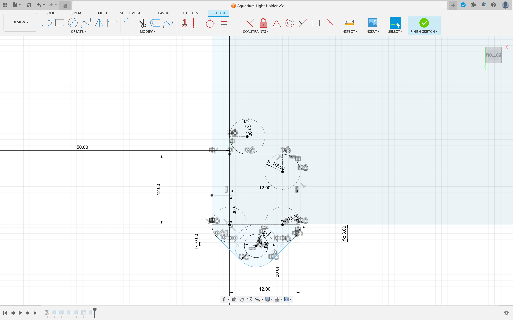
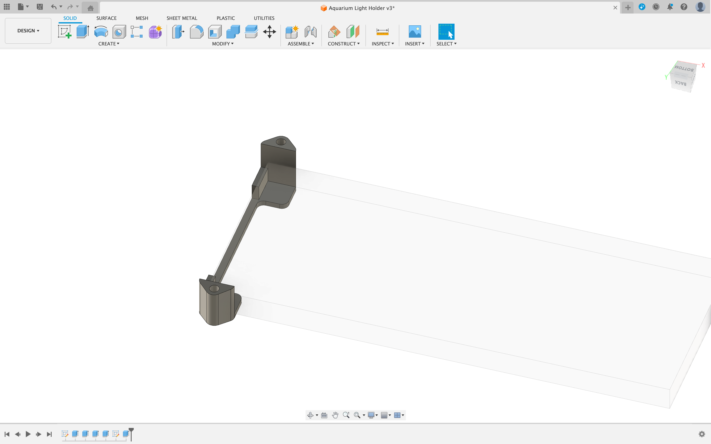
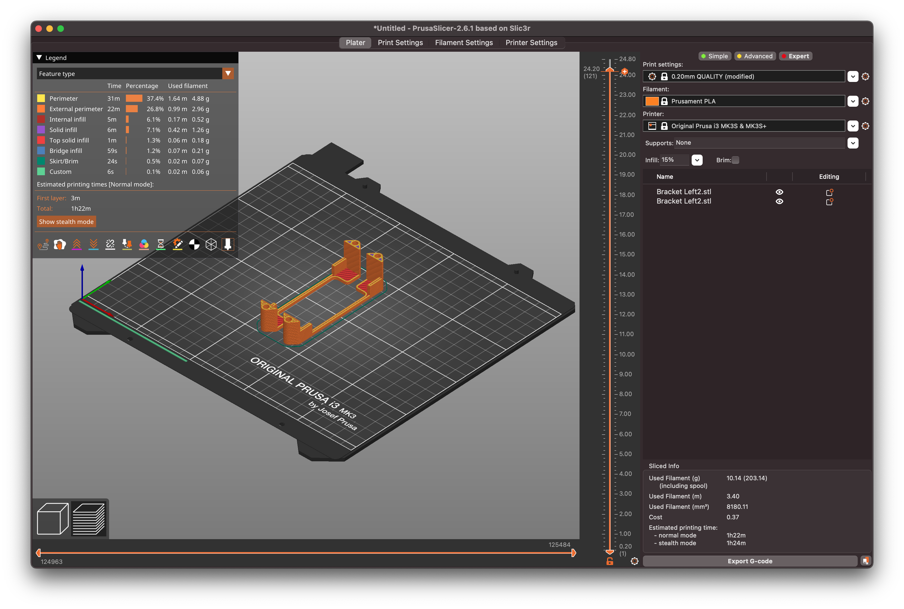
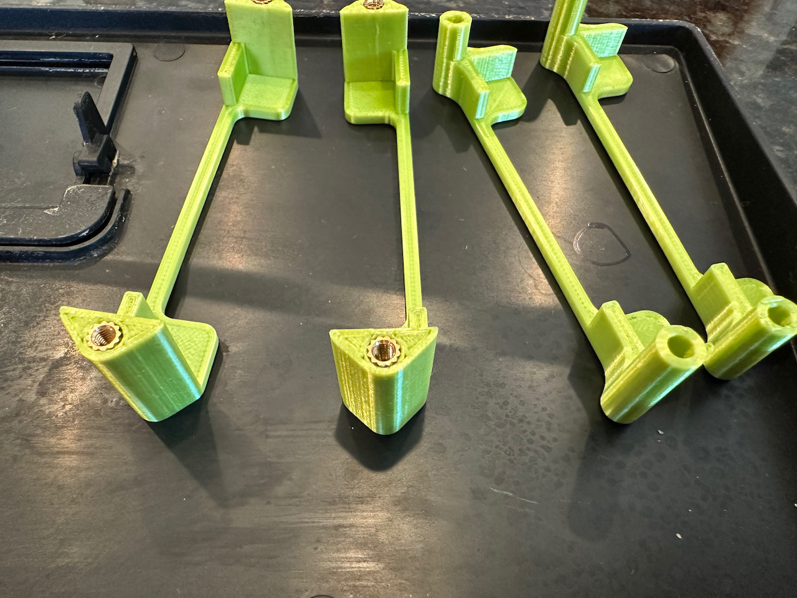
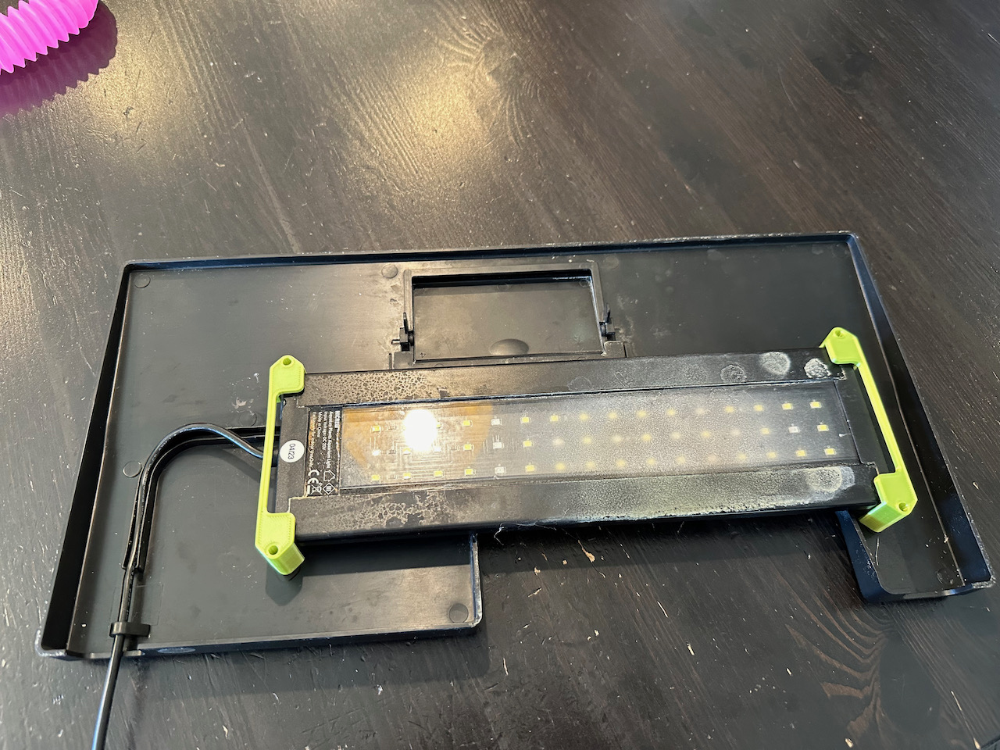
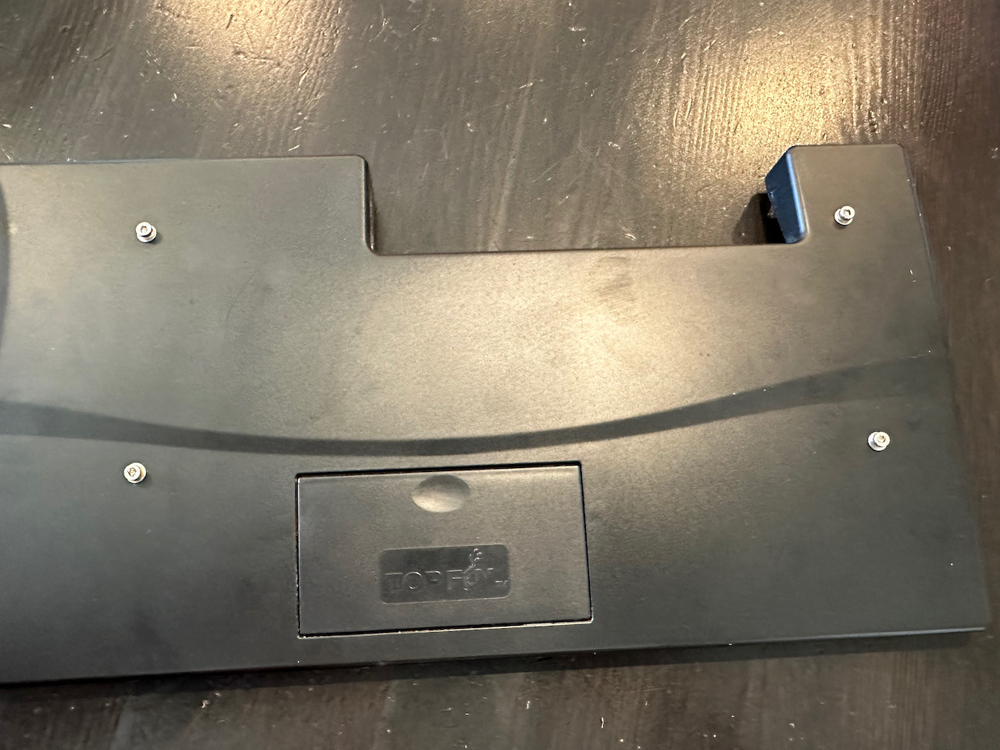

# Aquarium Light Fixture
Date: Nov 2023

The original light failed for our [aquarium](https://www.petsmart.com/fish/tanks-aquariums-and-nets/aquariums/top-fin-essentials-aquarium-starter-kit-40713.html). We bought a (much bigger) [replacement](https://www.amazon.com/gp/product/B08SBPVXCW). I initially used a hot glue gun to mount it. It lasted months, but failed. So designed and printed two brackets to hold it in place more securely. 

Used heat inserts for screw holes (probably overkill).
Also shows the first print of these, where put the screw hole off to the side. As I started printing those, I realized that that since the screw holes are offset such that the forces on it on mounted will likely cause them to twist, so updated the design to fix that.

One minor downside is that the screws heads will protude fro the lid, but they are small 

STL and fusion files in folder.
