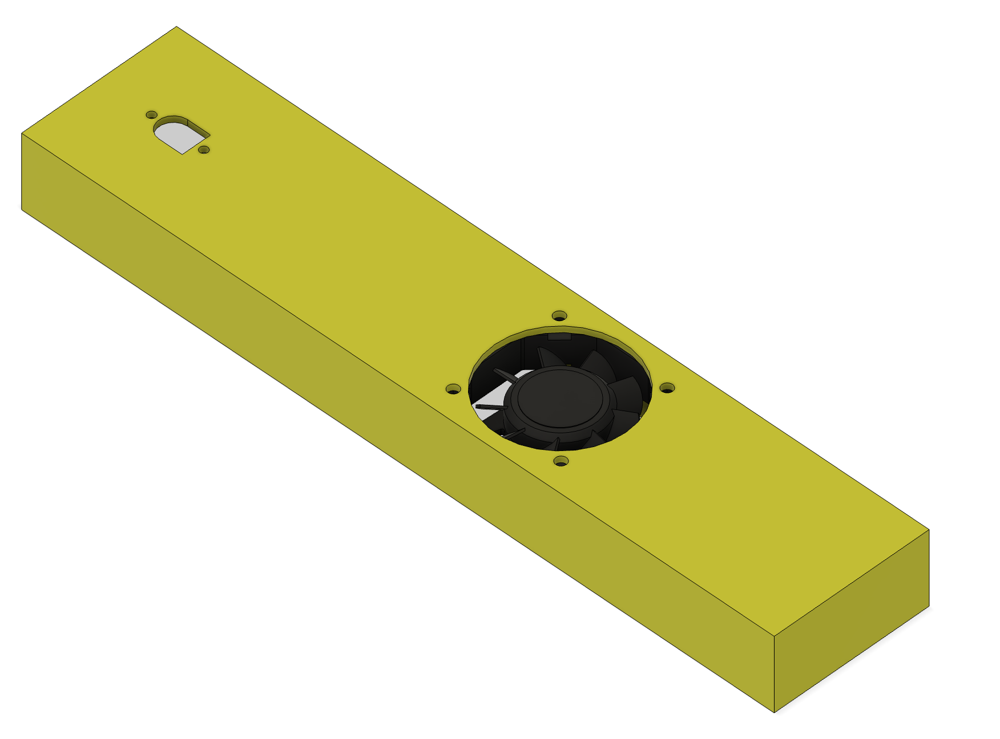
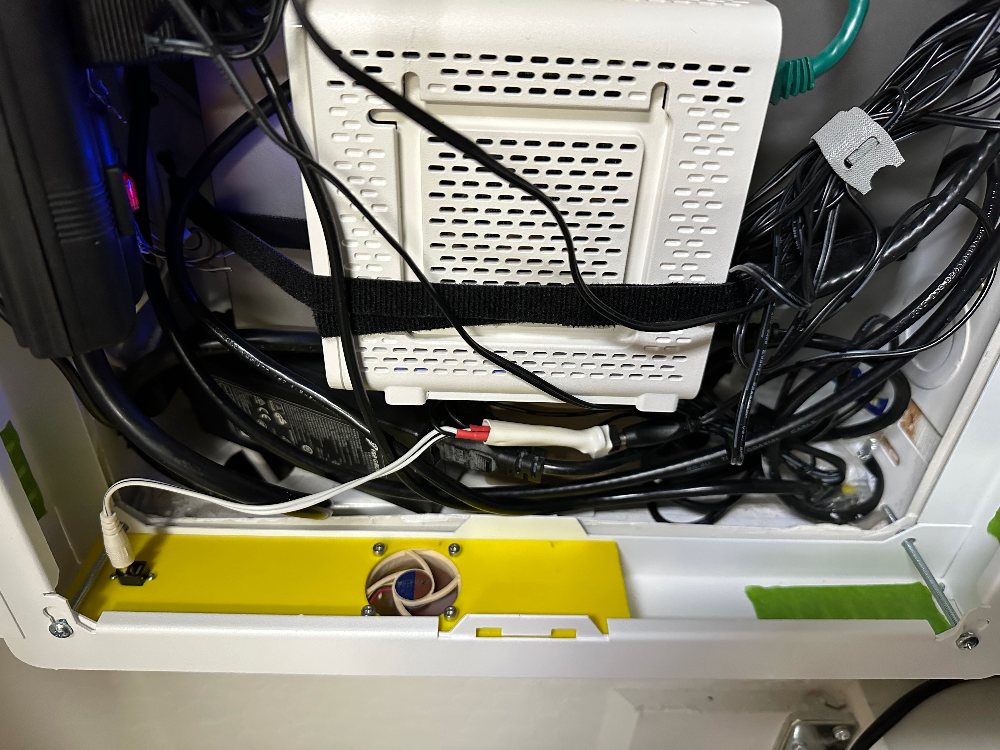

# SMC Fan Box

After I mounted much equipment inside the Leviton SMC (Structured Media Cabinet), it got pretty warm with passive airflow. The cabinet has comes out of the wall about a bit (because of an extension) so it has bottom vents. I built a box to go over the vents with a fan, and taped the other bottom vents shut so that air is only pulled in at the bottom and exhausted at the top.

